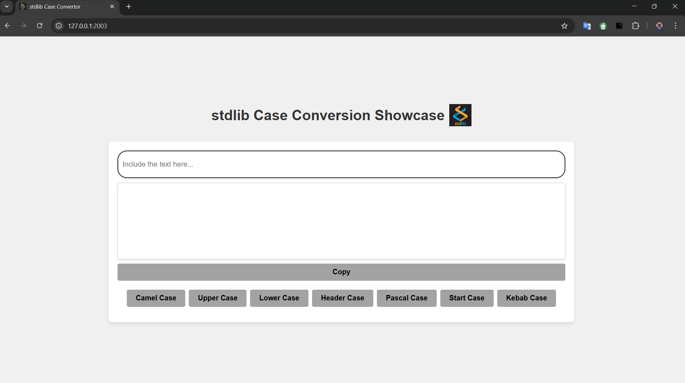
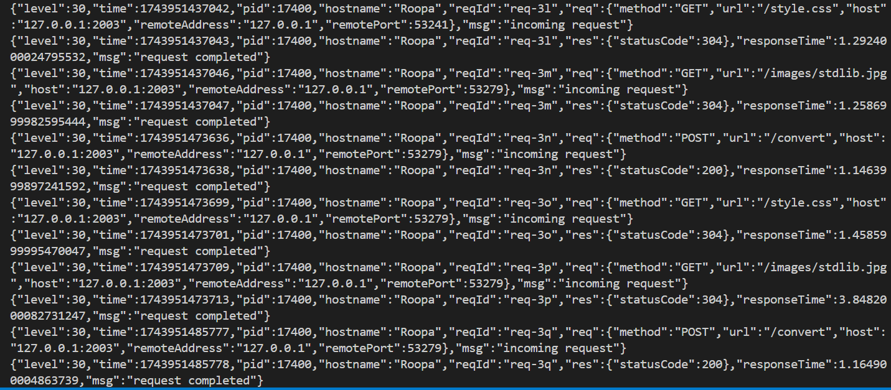
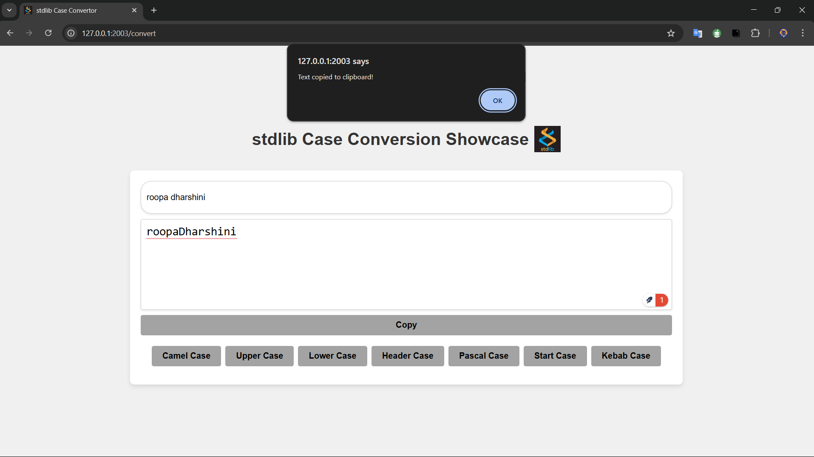
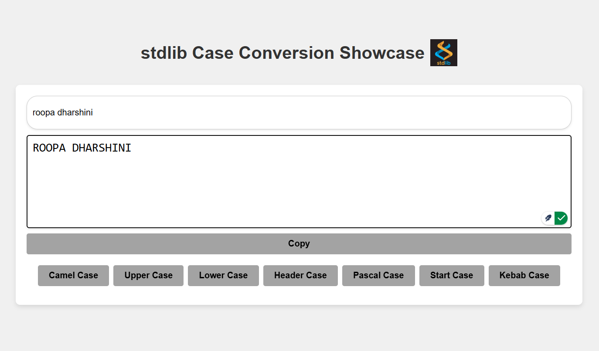
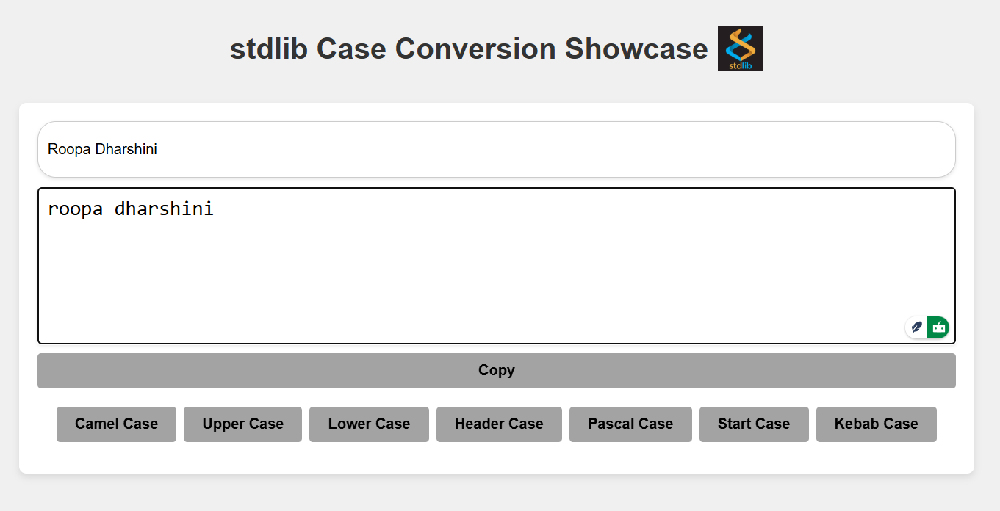
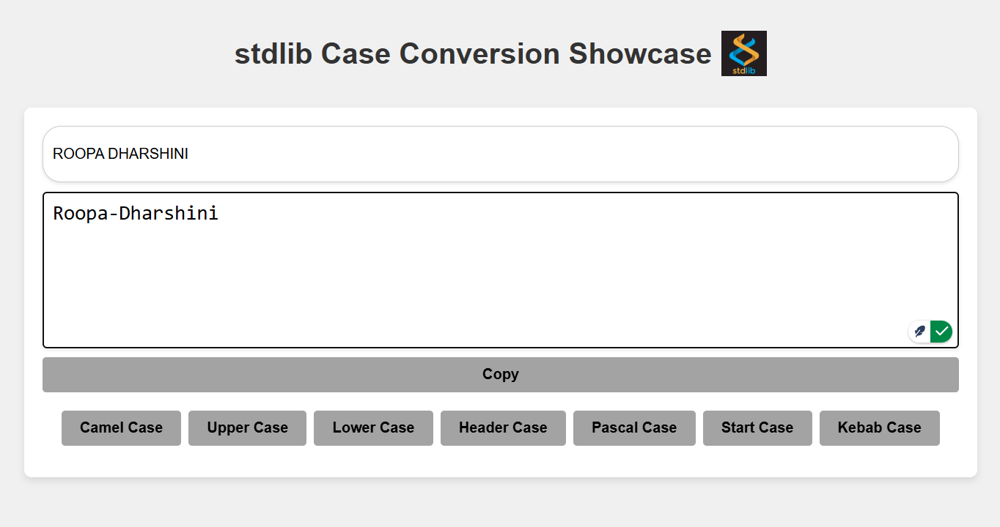
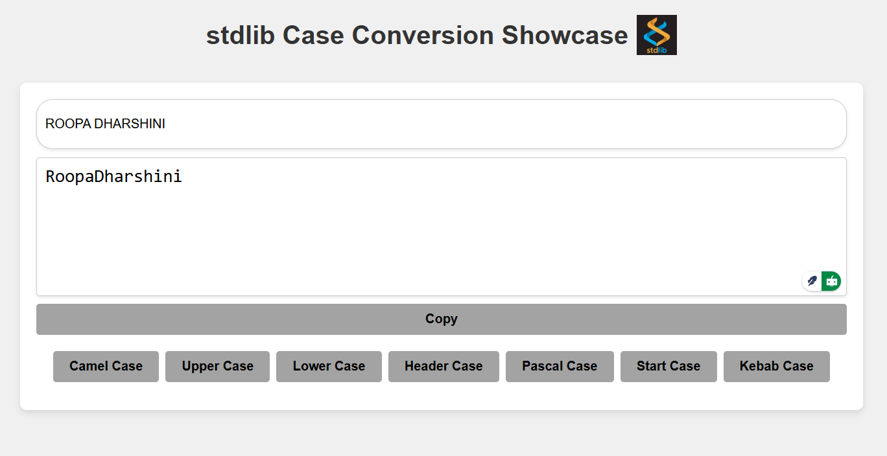

# stdlib-case-conversion-showcase

## Description
This project shows the different case conversion for a sentence using `@stdlib/string` library. This includes 
camel-case, upper-case, lower-case, header-case, pascal-case, start-case and kebab-case conversions. With the help of `@stdlib/string`, the sentence can be converted seamlessly.

## Tech stack
I used the following tech stack to build this project.

### Front-end
A simple single page to display various case conversion buttons, input area, display area for the output and copy clipboard function. These are implemented using basic `html` and `css`.

### Back-end
The backend of this project is achieved using `npm`, `Node JS` and `fastify`.

## Project Set-up
To setup the project in your local machine, follow the below guidance.

1. Fork the repository.
2. Copy the https:// link for the forked repo.
3. Clone the repository in your local machine using CLI (`git clone https://forked-repo-url.git`).
4. `cd` into the `src` folder to access the backend (`cd src`).
5. Start the backend server using the command `node script.js` (If you have nodemon installed, use `nodemon script.js`).
6. Open the local host url link to access the UI (You can found it in `http://localhost:2003`).

### Backend 

## Usage

Once you setup the project successfully, you can now include some title or sentence to play with the case conversion project. Here are the some of the examples:

### Camel-Case Conversion

### Upper-Case Conversion

### Lower-Case Conversion

### Header-Case Conversion

### Pascal-Case Conversion
